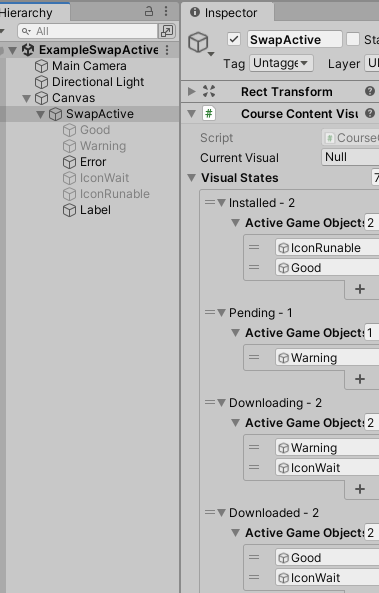

# Goal

Easily swap active gameobjects based on the value of a custom enum.

# Installation

Reference this package in your Unity project by either:

1. Modifying your projects `Packages/manifest.json` file to include this package subfolder as shown below. ([ref](https://docs.unity3d.com/Manual/upm-git.html#subfolder))
```
"dependencies": {
  "com.feddas.swapactive": "https://github.com/Feddas/upm.git?path=/Assets/SwapActive",
  ...
}
```

Then Start Unity.

2. Or add `https://github.com/Feddas/upm.git?path=/Assets/SwapActive` by using the [PackageManager UI](https://docs.unity3d.com/Manual/upm-ui-giturl.html). Optionally, for stability, you can [specify the exact revision using a commit hash at the end of the added URL](https://docs.unity3d.com/Manual/upm-git.html#revision).

# Usage

1. Define an enum with as manys states as you like. Here that enum will be called TEnum.
2. Then create a MonoBehaviour class that inherits VisualStateSwap<TEnum>.
3. Add that new MonoBehaviour to any manager gameobject. Expand its `Visual States` field to set as many gameobjects as you'd like to be active for each state. Once a gameobject is assigned to a state, it will be inactived for all other states.

# Example

This package includes one example that can be loaded through the unity package manager window.



To view the example, run `Example\ExampleSwapActive.unity` in the Unity editor. Active game objects are swapping out their SetActive values every 2 seconds just by being bound to a TEnum of `CourseContentVisualStates`.

View `CourseContentVisualSwap.cs` to see an example of how your custom enum could be setup.

# Repo

GitHub: https://github.com/feddas/upm/tree/master/Assets/SwapActive/
